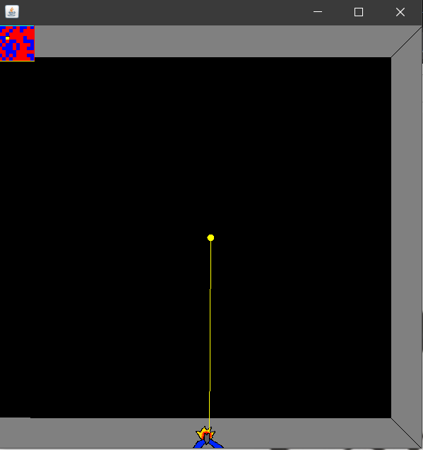
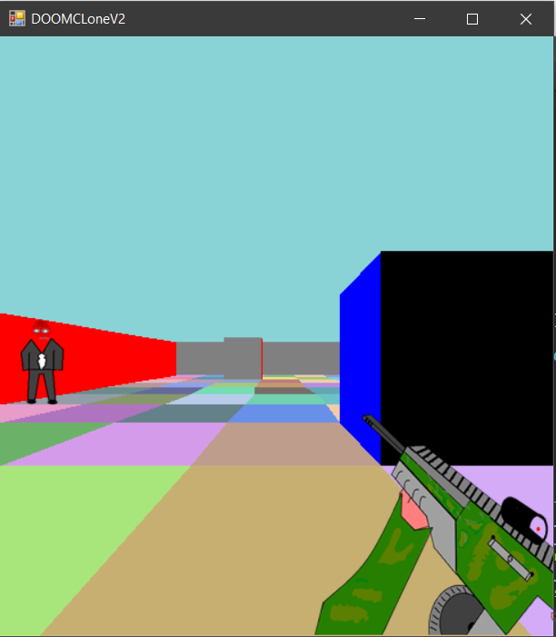

# GunRun
This is the updated README of an app I made in 2017, and remade in 2020.
GunRun is an early attempt at displaying a simple 3d engine using 2d graphics, as per
 .
The outcome was undesirable, however mildly functional.
## Features(Planned In Brackets)

* Random or discreet map generation *
* Translates 2D map to 3d world *
* Minimap implementation *

## Comparison of Old Version vs 2020:
**Old**

**New**

## Next Build

N/A

## Skill developing

I planned on this project improving my skills in the following:

>Pixel art/animation .

>Translation of 2D Information to 3D

>Java GUI Creation

>Initial VCS Implementation.

## Installing and Compiling:
A guide on running and compiling java programs can be found at [WikiHow](https://www.wikihow.com/Compile-%26-Run-Java-Program-Using-Command-Prompt)

However, the files contained in this repo can be downloaded and opened as a new project in 
a java IDE with the following project layout:

[FileLayout](Files.PNG)

To operate the program, use the 'wasd' keys to look around, with w/s being move back,foward.

Press the 'e' key to shoot, although there are no enemies in the game.

Enjoy! :P